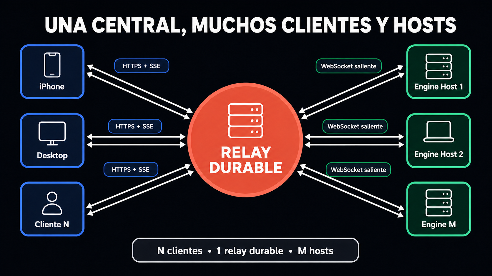

# Fermín

**Una central durable que toma custodia de tus órdenes y las hace llegar al
host correcto.**

Fermín nació de una necesidad concreta: tener una idea lejos de la
computadora, mandarla desde el iPhone y seguir con el día sin preguntarse si
llegó, si quedó duplicada o si después se podrá recuperar lo ocurrido.

> **Mandás una orden y dejás de vigilar el transporte.**

Codex sigue siendo quien razona, usa herramientas y modifica el workspace.
Fermín se ocupa del camino: recibe la intención, la guarda, la deriva hacia la
Mac indicada y conserva su historia.

[Entenderlo](#entenderlo-en-30-segundos) · [Verlo](#así-se-ve) ·
[Probarlo](#probarlo) · [Leer la documentación](#documentación)

## Entenderlo en 30 segundos

1. **Mandás una orden.** Puede salir del iPhone, Desktop u otra aplicación.
2. **El relay toma custodia.** La autentica, la guarda y deja registrada su
   historia antes de continuar.
3. **El host hace el trabajo.** Su engine entrega la orden a Codex y devuelve
   los eventos al relay.

Todos los clientes hablan con la misma central. Ninguno necesita conectarse
directamente con cada computadora.

```text
Clientes
   ↓
Relay durable
   ↓
Hosts con engine
   ↓
Codex
```

<a href="docs/images/architecture/relay-star-mobile.svg">
  <picture>
    <source media="(max-width: 600px)" srcset="docs/images/architecture/relay-star-mobile.svg">
    
  </picture>
</a>

<sub>Tocá el diagrama para verlo en tamaño completo.</sub>

## La forma que guía Fermín

La arquitectura objetivo es una estrella: N clientes, un relay durable y M
hosts. Los clientes conocen al relay. Los engines conocen al relay. No hay
conexiones directas cliente→engine.

La versión pública `v0.1` todavía usa **un par relay–engine por host**. Mobile y
Desktop eligen entre Primary y Secondary mediante endpoints separados. El
routing de varios hosts dentro de una única instancia de relay es la forma que
guía el diseño, no una función ya terminada ni una fecha prometida.

[Ver la arquitectura completa →](docs/ARCHITECTURE.md)

## Por qué importa

Podés estar caminando por la casa, yendo al kiosco o lejos de la Mac correcta.
Se te ocurre algo, mandás un audio o una orden desde el iPhone y seguís con tu
vida.

No tenés que quedarte mirando:

- si Internet se cortó justo en ese momento;
- si la aplicación quedó abierta;
- si la orden llegó;
- si un reintento la envió dos veces; o
- si después vas a poder recuperar lo ocurrido.

El relay convierte esa preocupación en infraestructura. Primero guarda la
intención. Después la hace llegar al lugar correcto. Finalmente conserva la
historia para que puedas volver desde otro dispositivo y encontrar el estado
correcto.

Esa confianza elimina fricción. Cuando mandar una idea deja de ser un pequeño
procedimiento técnico, aprovechás ideas que antes habrías dejado pasar por no
estar frente a la computadora indicada.

## Qué hace cada pieza

### Cliente

Expresa la intención y muestra qué ocurrió. Mobile y Desktop son dos clientes
de referencia. Se conectan al relay; nunca directamente al engine.

### Relay durable

Ocupa el centro. Recibe, autentica, guarda, ordena, deriva y permite retomar.
“Aceptada” significa que tomó custodia de la orden, no que Codex ya terminó.

### Engine

Vive en la Mac que hace el trabajo. Mantiene Codex App Server local, limita qué
workspaces puede tocar y traduce las órdenes de Fermín al contrato de Codex.

### Codex

Razona y ejecuta. Fermín no intenta reemplazarlo ni reconstruir su harness.

## Por qué no hablar directo con App Server

Una conexión directa sirve cuando el cliente, la Mac y la red están disponibles
al mismo tiempo. El relay agrega lo que necesita el uso remoto cotidiano:

- guarda la orden antes de aceptarla;
- reconoce un reintento sin duplicar la intención;
- conserva trabajo si el relay sigue disponible aunque el host se desconecte;
- reproduce eventos desde el cursor de cada cliente; y
- quita autoridad a conexiones viejas mediante leases y fencing.

App Server resuelve cómo trabaja Codex. Fermín resuelve cómo una intención llega
hasta él y cómo recuperás después lo que ocurrió.

## Así se ve

Mobile muestra que un cliente puede seguir muchas sesiones remotas desde el
iPhone. La captura usa contenido de demostración, no datos de una sesión real.

[](docs/images/en/mobile/mobile-many-sessions.png)

<sub>Tocá la captura para abrirla en resolución completa.</sub>

<details>
<summary><strong>Ver una conversación en Mobile</strong></summary>

[](docs/images/en/mobile/mobile-conversation.png)

</details>

<details>
<summary><strong>Ver Fermín Desktop</strong></summary>

[](docs/images/en/desktop/desktop-main.png)

</details>

## Qué contiene el repositorio

- **`service/`:** relay en Rust, engine para Mac y CLI de diagnóstico.
- **`desktop/`:** cliente nativo para macOS.
- **`mobile/`:** cliente nativo para iOS 17 o posterior.

Las tres superficies tienen código compilable. El repositorio no incluye un
relay alojado ni un instalador de consumo de un clic. Está dirigido hoy a
desarrolladores capaces de configurar macOS, Codex, ingreso TLS y tokens
privados.

## Probarlo

La forma más corta usa una sola Mac como relay y host. Necesitás macOS, Rust
1.92 o posterior, Xcode Command Line Tools, Xcode completo para Mobile,
XcodeGen y un Codex CLI compatible ya autenticado.

[Seguir el autoalojamiento paso a paso →](docs/SELF_HOSTING.md)

Si sólo querés comprobar un componente:

- [probar relay y engine](service/README.md);
- [ejecutar Desktop](desktop/README.md); o
- [generar Mobile](mobile/README.md).

Las URLs de ejemplo usan `relay.example.com` y no funcionan. Elegí tus propios
endpoints e ingresá los tokens desde las apps; se guardan en Keychain. Nunca
confirmes tokens en Git.

## Límites actuales

La versión pública es autoalojada y para una sola persona. Una instancia de
relay admite una generación activa de engine. No incluye cuentas,
multi-tenancy, pairing, relay alojado, actualizaciones automáticas, binarios
notarizados ni cifrado de extremo a extremo.

El relay escucha sólo en loopback. Para acceso remoto necesitás un proxy TLS,
una red privada o un túnel saliente. Una Mac dormida o apagada no puede
ejecutar trabajo; el relay sólo puede encolar si él mismo sigue disponible.

[Leer todos los límites y el modelo de seguridad →](docs/SECURITY_MODEL.md)

## Documentación

[Abrir la guía de documentación →](docs/README.md)

- [Arquitectura](docs/ARCHITECTURE.md): entender relay, engine, clientes y
  Codex.
- [Autoalojamiento](docs/SELF_HOSTING.md): montar la forma más corta en una
  Mac.
- [API](docs/API.md): integrar otro cliente con la central.
- [Modelo de seguridad](docs/SECURITY_MODEL.md): entender autoridad y riesgos.
- [Cómo explicar Fermín](docs/LAUNCH.md): comunicar el proyecto sin prometer de
  más.
- [Cómo contribuir](CONTRIBUTING.md): preparar un cambio útil.

## Licencia

Fermín usa la [licencia MIT](LICENSE).

Codex es un producto separado de OpenAI. Fermín no es un producto oficial de
OpenAI.
