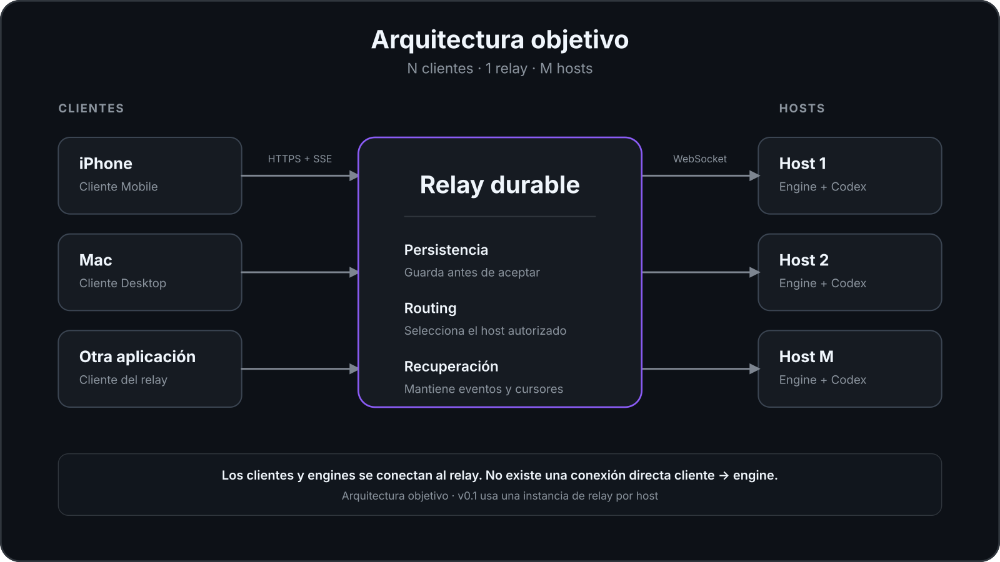
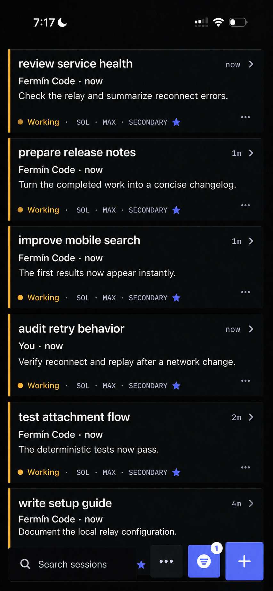
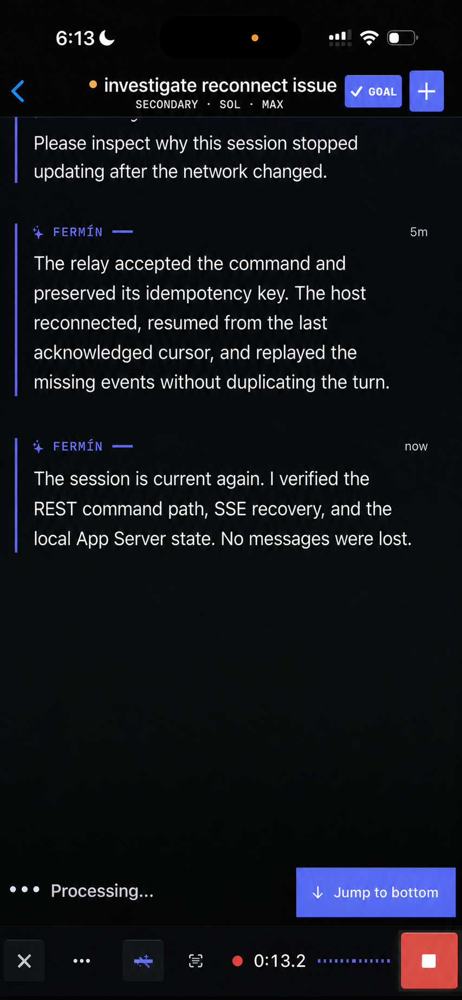

# Fermín

Fermín es un sistema autoalojado para operar sesiones de Codex que se ejecutan
en una Mac remota. Los clientes envían órdenes a un relay durable. El relay las
persiste y el engine de la Mac host las entrega a Codex.

Codex razona, usa herramientas y modifica el workspace. Fermín gestiona el
transporte remoto, la persistencia de las órdenes, la reconexión de los clientes
y la recuperación del historial.

[Funcionamiento](#funcionamiento) · [Topología](#topología) ·
[Instalación](#instalación) · [Documentación](#documentación)

## Funcionamiento

1. Un cliente envía una orden. Puede ser Mobile, Desktop u otra aplicación.
2. El relay autentica la solicitud y persiste la orden.
3. El engine del host recibe la orden y la entrega a Codex App Server.
4. Los eventos regresan al relay y quedan disponibles para los clientes.

Una orden pasa a estado `accepted` después de quedar guardada en el relay. Ese
estado confirma la recepción durable; no confirma que Codex haya terminado el
trabajo.

```text
Cliente
   ↓
Relay durable
   ↓
Engine del host
   ↓
Codex App Server
```

Los clientes se conectan al relay. No se conectan directamente al engine ni a
Codex App Server.

## Topología

### Estado de `v0.1`

Cada instancia de relay admite una generación activa de engine. Para operar dos
hosts, se despliega un par relay–engine por host y los clientes seleccionan el
endpoint Primary o Secondary.

```text
Primary
   ↓
Relay
   ↓
Engine
   ↓
Codex
```

```text
Secondary
   ↓
Relay
   ↓
Engine
   ↓
Codex
```

### Arquitectura objetivo

La arquitectura objetivo usa un relay para registrar varios hosts. Cada orden
incluye el host de destino y el relay la entrega al engine autorizado.

<a href="docs/images/architecture/relay-star-mobile.svg">
  <picture>
    <source media="(max-width: 600px)" srcset="docs/images/architecture/relay-star-mobile.svg">
    
  </picture>
</a>

<sub>El diagrama representa la arquitectura objetivo. La versión `v0.1` todavía
usa un relay por host. La imagen se puede abrir en resolución completa.</sub>

El routing de varios hosts dentro de una única instancia no está implementado
en `v0.1`. No existe una fecha comprometida para esa capacidad.

[Consultar la arquitectura completa](docs/ARCHITECTURE.md)

## Comportamiento ante interrupciones

- **Cierre del cliente:** una orden aceptada permanece en el relay. El cliente
  puede recuperar eventos posteriores mediante su cursor.
- **Reintento del cliente:** la misma clave de idempotencia identifica la misma
  orden y evita crear un duplicado.
- **Desconexión del engine:** el relay puede conservar trabajo pendiente si
  continúa disponible.
- **Reconexión del engine:** leases y fencing determinan qué conexión conserva
  autoridad.
- **Relay y engine en la misma Mac:** si esa Mac queda fuera de línea, el relay
  no puede aceptar órdenes nuevas durante la interrupción.

Fermín no enciende una Mac apagada y no garantiza ejecución exactamente una
vez. Si una orden llega a Codex y el engine falla antes de registrar el
resultado, el estado puede quedar como `unknown` y requiere reconciliación.

## Componentes

### Relay

Recibe solicitudes HTTP, autentica clientes, persiste órdenes, mantiene el
registro de eventos y expone actualizaciones mediante Server-Sent Events (SSE).
La conexión con el engine usa WebSocket autenticado.

### Engine

Se ejecuta en la Mac host. Inicia Codex App Server como proceso local, valida
versiones y capacidades, limita el acceso mediante `workspaceRoots` y traduce
las órdenes de Fermín al protocolo de Codex.

### Mobile y Desktop

Son clientes de referencia para iOS y macOS. Usan REST para enviar operaciones,
SSE para recibir eventos y Keychain para almacenar tokens. No ejecutan Codex ni
el engine.

### Codex App Server

Administra threads, turns, herramientas, sandbox, aprobaciones y ejecución.
Permanece local en la Mac host y no se publica directamente en Internet.

## Relación con Codex App Server

Un cliente puede conectarse directamente a App Server cuando el cliente, el
host y la red permanecen disponibles durante toda la operación. Fermín agrega
una capa durable para entornos remotos o intermitentes:

- persistencia antes de confirmar aceptación;
- idempotencia para reintentos;
- cola mientras el engine está desconectado y el relay sigue disponible;
- replay por cursor para cada cliente; y
- leases y fencing para controlar la autoridad de las conexiones.

App Server ejecuta el trabajo de Codex. Fermín administra la entrega y el
historial remoto de ese trabajo.

## Interfaces de referencia

La siguiente captura muestra el cliente Mobile con datos de demostración.

[](docs/images/en/mobile/mobile-many-sessions.png)

<sub>La imagen se puede abrir en resolución completa.</sub>

<details>
<summary><strong>Conversación en Mobile</strong></summary>

[](docs/images/en/mobile/mobile-conversation.png)

</details>

<details>
<summary><strong>Cliente Desktop</strong></summary>

[](docs/images/en/desktop/desktop-main.png)

</details>

## Contenido del repositorio

- **`service/`:** relay, engine y CLI de diagnóstico escritos en Rust.
- **`desktop/`:** cliente nativo para macOS.
- **`mobile/`:** cliente nativo para iOS 17 o posterior.

Las tres superficies contienen código compilable. El repositorio no incluye un
relay alojado ni un instalador de un paso. La instalación actual requiere
experiencia con macOS, Codex, TLS y administración de tokens.

## Instalación

La topología local mínima ejecuta relay, engine y Codex en una misma Mac.
Requiere macOS, Rust 1.92 o posterior, Xcode Command Line Tools, un Codex CLI
compatible y autenticado, y Xcode con XcodeGen si se compila Mobile.

[Seguir la guía de autoalojamiento](docs/SELF_HOSTING.md)

Para verificar un componente por separado:

- [relay y engine](service/README.md);
- [cliente Desktop](desktop/README.md); o
- [cliente Mobile](mobile/README.md).

Las URLs de ejemplo usan `relay.example.com` y no son endpoints operativos.
Los tokens se configuran localmente y los clientes Apple los almacenan en
Keychain. No confirmes tokens en Git.

## Límites de `v0.1`

- Uso autoalojado para una persona.
- Una generación activa de engine por instancia de relay.
- Sin cuentas, multi-tenancy ni pairing de dispositivos.
- Sin relay alojado ni actualizaciones automáticas.
- Sin binarios notarizados para distribución pública.
- Sin cifrado de extremo a extremo del contenido.

El relay escucha sólo en loopback. El acceso remoto requiere un proxy TLS, una
red privada o un túnel saliente. Una Mac dormida o apagada no puede ejecutar
trabajo. El relay sólo puede mantener una cola si continúa disponible.

[Consultar el modelo de seguridad](docs/SECURITY_MODEL.md)

## Documentación

- [Índice de documentación](docs/README.md)
- [Arquitectura](docs/ARCHITECTURE.md)
- [Autoalojamiento](docs/SELF_HOSTING.md)
- [API](docs/API.md)
- [Modelo de seguridad](docs/SECURITY_MODEL.md)
- [Descripción pública](docs/LAUNCH.md)
- [Contribuciones](CONTRIBUTING.md)

## Licencia

Fermín usa la [licencia MIT](LICENSE).

Codex es un producto separado de OpenAI. Fermín no es un producto oficial de
OpenAI.
