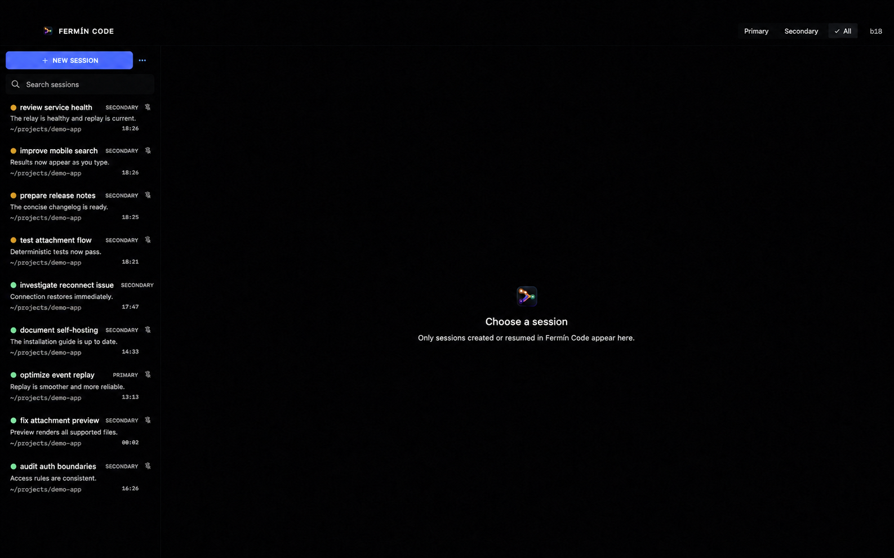

# Cliente Desktop de Fermín

[← Volver al README](../README.md)

Es el cliente nativo SwiftUI para macOS. Es una ventana sobre la central: se
conecta únicamente al relay y nunca habla directamente con un engine.

Hace cuatro cosas:

- llama al relay mediante REST;
- recibe eventos en vivo mediante SSE;
- guarda tokens de cliente en Keychain; y
- combina dos perfiles opcionales en una sola vista.

No inicia Codex, no ejecuta el engine y no expone un servidor HTTP local. El
trabajo continúa en la Mac host aunque cierres este cliente.

[](../docs/images/en/desktop/desktop-main.png)

<sub>Tocá la captura para verla en resolución completa.</sub>

El target y algunos identificadores siguen usando el nombre interno Fermín Code
por compatibilidad. El nombre público del producto es Fermín; este cambio
documental no renombra código ni bundles operativos.

## Probar y ejecutar

```bash
swift test
FERMIN_CODE_PRIMARY_RELAY_URL=http://127.0.0.1:8840 swift run FerminCode
```

HTTP plano sólo es válido en loopback durante desarrollo. Usá HTTPS para un
relay remoto.

## Generar la app de Xcode

```bash
xcodegen generate
open FerminCodeDesktop.xcodeproj
```

Configurá:

- `FERMIN_CODE_PRIMARY_RELAY_URL`
- `FERMIN_CODE_SECONDARY_RELAY_URL`

En desarrollo y pruebas, variables de entorno con los mismos nombres
sobrescriben Info.plist.

El proyecto apunta a `relay.example.com`, que es deliberadamente inoperante.
Elegí tu propio equipo de firma. El repositorio no contiene endpoints de
producción, team IDs ni credenciales.

[Conectar relay, engine y clientes paso a paso →](../docs/SELF_HOSTING.md)
